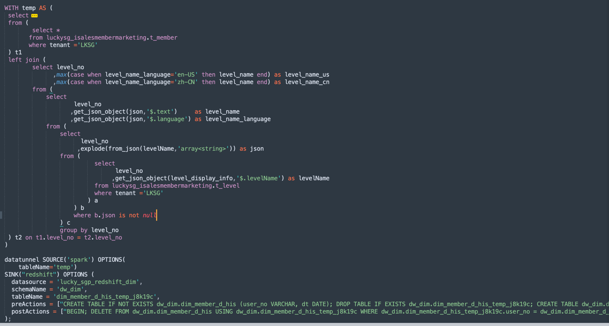

## 基于spark 的数据集成平台

DataTunnel 是一个基于spark引擎的超高性能的分布式数据集成软件，支持海量数据的同步。基于spark extensions 扩展的DSL语法，结合的Spark SQL，更加便捷融入数仓 ETLT 过程中，简单易用。

DataTunnel 特性：
1. Spark 是一个非常成熟大数据引擎，有非常成熟的connector，例如 es、mongodb、redshift、snowflake、cassandra 等产品官方维护了spark connector
2. 插件式设计让用户可以轻松开发自己的Connector并将其集成到Datatunnel中。
3. 支持多表或全库同步。
4. 高吞吐量、低延迟，持并行读写，提供稳定可靠的高吞吐量、低延迟的数据同步能力。
5. 支持两种作业开发方法：spark sql运行方式，以及向导模式。
6. 支持bulk insert(pg, mysql, oceanbase等)


## Build
[build.md](build.md)

## 部署

1. 解压 assembly/target/ 目录下生成可用包 datatunnel-[version].tar.gz。
2. 解压datatunnel-[version].tar.gz，把解压后目录中所有jar复制到 SPARK_HOME/jars
3. conf/spark-default.conf 添加如下配置: 
> spark.sql.extensions com.superior.datatunnel.core.DataTunnelExtensions

## datatunnel sql 语法

启动 ./bin/spark-sql，可以直接执行如下SQL 语法

```sql
-- 查看不同数据源 options 参数，如果指定SOURCE，只输出数据source options参数，如果指定SINK，只输出数据sink options参数。如果输出为空，说明不支持source或者sink
datatunnel help (source | sink | all) ('数据源类型名称')

```

```sql
-- spark source 支持CTE语法，方便原表数据经过处理过，写入到目标表，其他数据源不支持CTE 语法。
-- 相比 transform 更灵活
WITH t AS (
    WITH t2 AS (SELECT 1)
    SELECT * FROM t2
)
datatunnel 
source('数据源类型名称') options(键值对参数) 
transform '数据加工SQL，可以对数据处理后输出'
sink('数据源类型名称') options(键值对参数)

-- transform 支持select 语句，对source 输出数据进行ETL 加工处理，需要在source options 中指定 sourceTempView 参数，运行是，对source df注册 spark temp view。TRANSFORM 的 select sql 中使用该temp view

DATATUNNEL SOURCE("s3") OPTIONS (
    format = "json",
    filePath = "s3a://datacyber/melin1204/",
    sourceTempView='tdl_users'
) 
TRANSFORM = 'select id, userid, age from tdl_users'
SINK("redshift") OPTIONS (
    username = "admin",
    password = "Admin2024",
    jdbcUrl = "jdbc:redshift://redshift-cluster-1.xxxx.us-east-1.redshift.amazonaws.com:5439/dev",
    schemaName = "public",
    tableName = "users1",
    writeMode = "UPSERT",
    upsertKeyColumns = ["id"],
    tempdir = "s3a://datacyber/redshift_temp/",
    region = "us-east-1",
    accessKeyId = "${accessKeyId}",
    secretAccessKey = "${secretAccessKey}",
    iamRole = "${iamRole}",
    columns = ["*"]
)

```

## 支持数据源

JDBC 写入支持Append，Overwrite, Upsert, bulkInsert。bulkInsert 支持mysql（load data），Postgresql(基于copy from，兼容pg数据库都可以)，

| 数据源                           | Reader | Writer    | 文档                                                                                                                                                                              |
|:------------------------------------------|:----------| :------      |:--------------------------------------------------------------------------------------------------------------------------------------------------------------------------------|
| ftp                           | √         | √            | [读写](doc/ftp.md)  支持excel, json，csv, parquet、orc、text 文件                                                                                                                        |
| s3(alias: minio、oss、cos)    | √         | √            | [读写](doc/s3.md) 支持excel, json，csv, parquet、orc、text 文件                                                                                                                          |
| hdfs                          | √         |              | [读](doc/hdfs.md) 支持excel, json，csv, parquet、orc、text 文件, 例如 阿里云 rds 数据导出 oss， 再通过discp 写入到本地hdfs                                                                                |
| jdbc                          | √         | √            | [读写](doc/jdbc.md) 支持: mysql，oracle，db2，sqlserver，hana，guassdb(dws)，postgresql, hashdata, greenplum                                                                              |
| hive(alias: spark)            | √         | √            | [读写](doc/hive.md)，别名：spark                                                                                                                                                      |
| hbase                         | √         | √            | 读  [hbase spark config](https://github.com/apache/hbase-connectors/blob/master/spark/hbase-spark/src/main/scala/org/apache/hadoop/hbase/spark/datasources/HBaseSparkConf.scala) |
| clickhouse                    | √         | √            | [读写](doc/clickhouse.md) 基于 spark-clickhouse-connector 项目                                                                                                                        |
| cassandra                     | √         | √            | [读写](doc/cassandra.md)                                                                                                                                                          |
| elasticsearch                 |           | √            | [读写](doc/elasticsearch.md) elasticsearch 7 版本                                                                                                                                   |
| log                           |           | √            | [写](doc/log.md)                                                                                                                                                                 |
| kafka                         | √         | √            | [写](doc/kafka.md) (支持流失写入delta，iceberg, paimon，hudi)                                                                                                                            |
| doris                         | √         | √            | [读写](doc/doris.md) 基于 doris-spark-connector                                                                                                                                     |
| starrocks                     | √         | √            | [读写](doc/starrocks.md) 基于 starrocks-spark-connector                                                                                                                             |
| redis                         |           | √            | [写](doc/redis.md)                                                                                                                                                               |
| aerospike                     | √         | √            | [读写](doc/aerospike.md) 相比redis 性能更好                                                                                                                                             |
| maxcompute                    | √         | √            | [读写](doc/maxcompute.md)                                                                                                                                                         |
| redshift                      | √         | √            | [读写](doc/redshift.md)  https://github.com/spark-redshift-community/spark-redshift                                                                                               |
| snowflake                     | √         | √            | [读写](doc/snowflake.md)  https://github.com/snowflakedb/spark-snowflake                                                                                                          |
| Bigquery                      | √         | √            | [读写](doc/bigquery.md)  https://github.com/GoogleCloudDataproc/spark-bigquery-connector                                                                                          |
| Mongodb                       | √         | √            | [读写]                                                                                                                                                                            |

## [example](examples%2Fsrc%2Fmain%2Fkotlin%2Fcom%2Fsuperior%2Fdatatunnel%2Fexamples)

> 结合平台管理数据源，避免在sql中直接写入数据源账号信息

 数据ODS层数据存储在S3, dwd,dws 层数据存储在redshift。spark 读取数据，加工处理后，直接写入redshift



## 数据导出: Export

文档: [export.md](doc%2Fexport.md)

```
-- 指定导出文件目录，通过后缀信息，指定导出文件格式，目前支持：txt、csv、json、excel 四种文件
WITH common_table_expression [ , ... ]
export table tablename [PARTITION (part_column="value"[, ...])] TO 'export_data_dir.[txt|csv|json|xlsx]' [options(key=value)]
```

## Spark DistCp 语法
s3、hdfs、ftp、sftp、ftps 之间直接传输文件

```sql
distCp options(键值对参数)
```
| 参数              | 默认值                  | 描述                     |
|-----------------|----------------------|------------------------|
| srcPaths        |                      | 待同步文件或者目录，支持多值         |
| destPath        |                      | 同步输出目录                 |
| update          | false                | Overwrite if source and destination differ in size, or checksum                       |
| overwrite       | false                | Overwrite destination, |
| delete          | false                | Delete the files existing in the dst but not in src          |
| ignoreErrors    |                      | 执行未做任何更改的试运行           |
| dryrun          |                      | Perform a trial run with no changes made           |
| maxFilesPerTask | 1000                 | Maximum number of files to copy in a single Spark task        |
| maxBytesPerTask | 1073741824L          | Maximum number of bytes to copy in a single Spark task        |
| numListstatusThreads  | 10   | Number of threads to use for building file listing          |
| consistentPathBehaviour   | false | Revert the path behaviour when using overwrite or update to the path behaviour of non-overwrite/non-update          |
| includes          |                      | |
| excludes          |                      | |
| excludeHiddenFile | true                | 同步排除隐藏文件和目录 |

```sql
set spark.hadoop.fs.oss.endpoint = oss-cn-hangzhou.aliyuncs.com;
set spark.hadoop.fs.oss.accessKeyId = xxx;
set spark.hadoop.fs.oss.accessKeySecret = xxx;
set spark.hadoop.fs.oss.attempts.maximum = 3;
set spark.hadoop.fs.oss.connection.timeout = 10000;
set spark.hadoop.fs.oss.connection.establish.timeout = 10000;
set spark.hadoop.fs.oss.impl = org.apache.hadoop.fs.aliyun.oss.AliyunOSSFileSystem;
-- mysql 数据导出到 oss
DATATUNNEL SOURCE("mysql") OPTIONS (
  username = "root",
  password = "root2023",
  host = '172.18.5.44',
  port = 3306,
  databaseName = 'demos',
  tableName = 'orders',
  columns = ["*"]
) 
SINK("hdfs") OPTIONS (
  filePath = "oss://melin1204/users",
  writeMode = "overwrite"
)

-- oss 复制到 hdfs
DISTCP OPTIONS (
  srcPaths = ['oss://melin1204/users'],
  destPath = "hdfs://cdh1:8020/temp",
  overwrite = true,
  delete = true,
  excludes = [".*/_SUCCESS"]
)
     
--- sftp 同步数据到 minio 对象存储
set spark.hadoop.fs.sftp.impl = com.superior.datatunnel.hadoop.fs.sftp.SFTPFileSystem
set spark.hadoop.fs.sftp.host = 172.24.5.213
set spark.hadoop.fs.sftp.host.port = 22
set spark.hadoop.fs.sftp.user.172.24.5.213 = root
set spark.hadoop.fs.sftp.password.172.24.5.213.root = 123caoqwe
set spark.hadoop.fs.s3a.access.key = xxxx
set spark.hadoop.fs.s3a.secret.key = xxxxxxxxx
set spark.hadoop.fs.s3a.endpoint = http://172.18.6.181:9330/
set spark.hadoop.fs.s3a.path.style.access = true
set spark.hadoop.fs.s3a.impl = org.apache.hadoop.fs.s3a.S3AFileSystem

DISTCP OPTIONS (
  srcPaths = ['sftp://root@172.24.5.213/root'],
  destPath = "s3a://logs/",
  overwrite = true,
  delete = true,
  excludeHiddenFile = true
)
```

## 参考

1. [Bucket4j 限流库](https://github.com/vladimir-bukhtoyarov/bucket4j)
2. https://github.com/housepower/spark-clickhouse-connector
3. https://github.com/apache/incubator-seatunnel
4. https://www.oudeis.co/blog/2020/spark-jdbc-throttling-writes/
5. https://sparkbyexamples.com/spark/add-multiple-jars-to-spark-submit-classpath/
6. https://github.com/CoxAutomotiveDataSolutions/spark-distcp
7. https://gitlab.com/lwaldmann/Hadoop-FTP-FTPS-SFTP-filesystem
